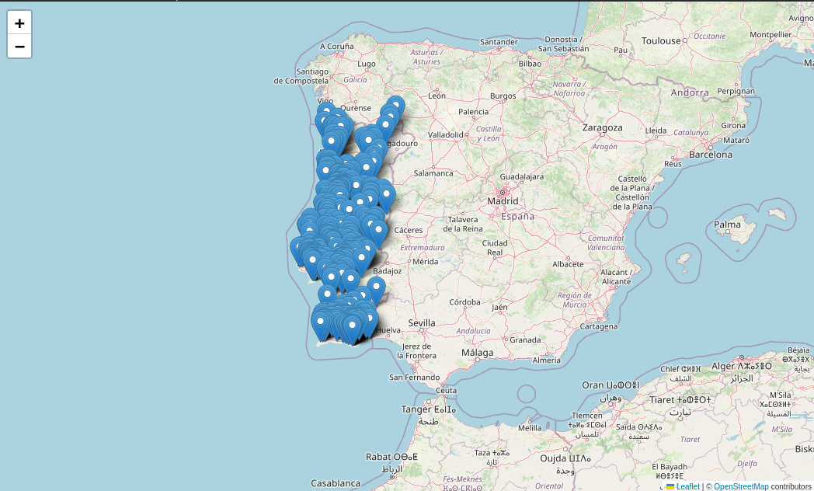
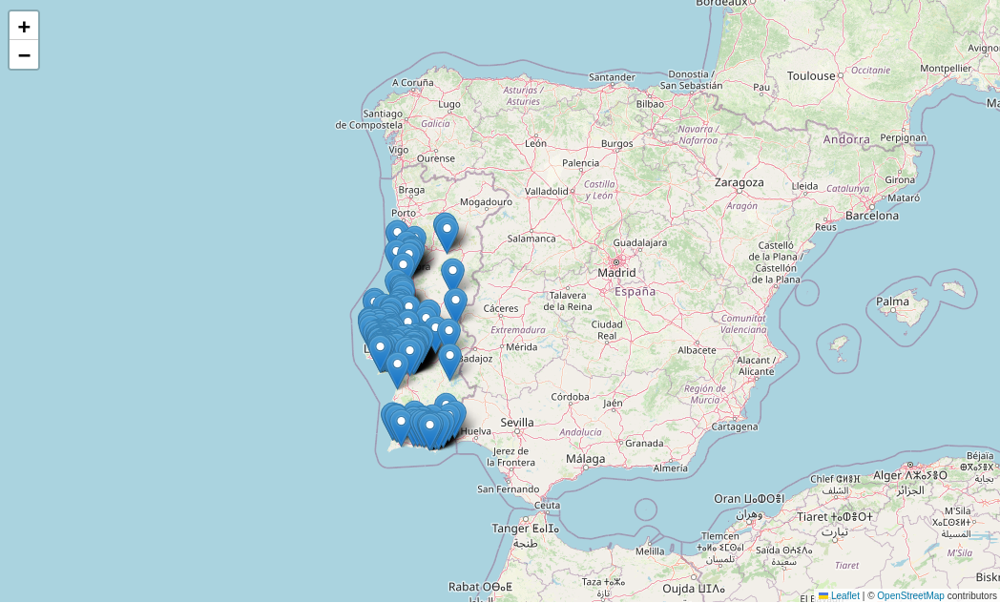

# Sistemas Inteligentes e Robótica

### Instituto Superior de Agronomia

# Exercício 1 - simular o preenchimento de lacunas de dados

# 1. Introdução

O objectivo deste exercício é realizar um *workflow* de análise exploratória de dados
recorrendo a AI para gerar código python. Neste caso, será utilzada a AI 
Gemini integrada no notebook em Google Colab.

Serão realizados os seguintes passos:

1. Gerar um novo notebook Colab;
2. Gerar uma tabela de dados simulada;
3. Analisar os dados com estatísticas de sumário;
4. Resolver problemas de lacunas de dados;
5. Realizar análise exploratória com os dados corrigidos.

Durante este exercício, é possível que surjam erros no código gerado pelo Gemini
que deve ser detectados e corrigidos.


## Instruções e convenções para este documento

Este documento está estruturado segundo uma sequência de prompts a fazer à chat AI,
que estão indicados por uma caixa de código. Exemplo:

```
In python, create a simulated dataframe containing three columns of text containing 
the name, address and phone number of people.
```
O acesso à ferramenta AI Gemini faz-se clicando no icon .


De seguida, o notebook contém a **bold** a indicação do que deve ser analisado 
nos resultados da execução do código gerado. Por exemplo:

### Questão Q1:
**Q1. Compare o valor das médias entre os métodos.**

Crie uma célula de texto no notebook para adicionar a sua resposta. 

Note que é possível que o chat com o Gemini não seja arquivado. Por isso, em 
cada passo, recomenda-se que o texto da prompt seja adicionado a uma célula 
de texto, anterior à célula de código que foi gerada a partir desta, com uma nota
explicativa do que se pretende fazer. 

São também adicionados blocos de texto com explicação ou apontadores externos para mais documentação:

>Para saber mais sobre python, consulte [https://www.python.org/](https://www.python.org/).


# 2. Ambiente para realização do exercício

O exercício será realizado com recurso à linguagem de programação ***Python***, mas usando ***Jupyter Notebook***.

O Jupyter Notebook é uma aplicação web de código aberto para criar e partilhar documentos computacionais interativos utilizando diversas linguagens de programação. Utiliza o formato de ficheiro .ipynb, que combina texto (em formato Markdown), código e resultados num único ficheiro. O código pode estar em mais de 40 linguagens diferentes (R, Julia, Scala, etc.), embora neste curso utilizemos Python.

O facto de ser interativo torna-o muito conveniente para o desenvolvimento de análises de ciência de dados. Após a execução, pode exportar o caderno como um relatório em PDF ou HTML.


### Estrutura de um Jupyter Notebook

Os Jupyter Notebooks são uma combinação de três tipos de componentes:

- células de código, que contêm código na linguagem selecionada para o kernel;
- células de texto, que contêm texto em formato Markdown;
- componentes de saída, que exibem os resultados da execução do código. Podem conter saídas de texto, tabelas, gráficos, imagens, etc.

Podem ser adicionas quantas células quiser ao seu Jupyter Notebook. No momento em que adiciona uma célula, define-a como sendo do tipo código (*code*) ou Markdown (*text*).

Uma nota importante sobre os Notebook é que as células de código têm de ser executadas em sequência. Muitas vezes, os resultados de uma célula são utilizados pelas células seguintes.


Neste exercício, usaremos o serviço Google Collaboratory, que é uma implementação na cloud do Jupyter Notebook. Podemos, desde modo, realizar um exercício usando recursos de infraestrutura na cloud. 

# 3. Realização dos exercícios


# Exercício 1

## 1. Gerar um novo notebook Colab

Em Google Drive, crie uma nova pasta chamada SIR. Nesta,
crie um novo Google Colab, com o menu de contexto (botão direito do rato). 
Para melhor documentar o seu notebook:
- altere o nome do notebook para `SIR_Exerc_01.ipynb`
- adicione um título numa célula markdown no topo do notebook, por exemplo
`# Exercício 01 - Análise exploratória de dados`

> Sobre o **Markdown**: É uma linguagem de formatação simples que permite adicionar 
estilos a texto. Por exemplo, para formatar com itálico, é necessário apenas colocar
um asterisco antes e depois da palavra ou texto a formatar. As células de texto
em Jupyter usam Markdown para melhorar a leitura. <br><br>
> Para experimentar, pratique com o [seguinte exercício](https://github.com/isa-ulisboa/greends-fads-exercises/blob/main/fads_ex_05_markdown.md). 


## 2. Gerar e analisar uma tabela de dados simulada

## 2.1. Gerar uma tabela de dados simulados

Vamos gerar uma tabela que simula parâmetros do solo produzidos por sensores IoT.
Pretende-se obter dados de temperatura, água, humidade, nutrientes, pH e condutividade
eléctrica. Além disso, pretende-se que os dados reproduzam as relações e tendências
normalmente observadas nestes parâmetros. Pretende-se que os dados sejam organizados
num dataframe, normalmente usado para trabalhar dados tabulares.

Para gerar o código que produz esta tabela, use, por exemplo, a seguinte prompt ao 
Gemini:

```
Crie um conjunto de dados de dados simulados para um sensor IoT de parâmetros do solo. 
Os parâmetros são temperatura, humidade do solo, nutrientes (K, N, P), pH e condutividade eléctrica. 
O sensor deve medir às seguintes profundidades: 20 cm, 40 cm, 60 cm e 100 com. 
Incluir nos dados simulados as tendências, variações e relações entre parametros 
que são normalmente observados nestes dados em conjuntos de dados reais. O novo 
conjunto de dados deve ser um dataframe chamado soil_simulated. Incluir gráficos de visualização das variáveis geradas.
```

O Gemini irá perguntar se pretende correr todo o código automaticamente, ou passo a passo. Seleccione `Accept & auto-run`.

### Questão Q1:
**Q1. Analisar o código gerado, e as células de output geradas. Consegue 
encontrar um exemplo de conjunto de dados online sobre um dos parámetros simulados,
e fazer a comparação com os dados simulados, de modo a perceber se estes têm alguma adesão à realidade?**

## 2.2. Pesquisar online por dados similares

Será que os dados gerados têm qualquer adesão à realidade? 

Usando o Google ou outra plataforma de pesquisa, procure online por um conjunto de dados reais similar ao que acabou de simular. Concentre-se num parâmetro, por exemplo, humidade do solo (*soil moisture*). Descarregue o conjunto de dados que conseguir encontrar, crie um gráfico em excel para o parâmetro sugerido, e compare com o parâmetro gerado pelo Gemini.


### Questão Q2:
**Q2. Ao pesquisar online por conjuntos de dados IoT de parâmetros do solo, por exempl, humidade, que princípio FAIR dos dados está a utilizar, para os encontrar? Esse princípio está a ser aplicado sobre os dados, ou metadados?**

## 2.3. Gerar uma tabela com simulação de ausência de dados

Iremos fazer uma cópia da tabela de dados gerada, e remover valores para simular
lacunas de dados. Pode fazer-se isso, por exemplo, com a seguinte prompt:
```
Cria uma cópia do dataframe soil_simulated. Nesta cópia simula que existem dados ausentes, 
numa taxa entre 5 e 15%.
```
Note que as tabelas têm nomes diferentes.

### Questão Q3:
**Q3. Pode alterar a prompt para obter outros resultados, ou então editar 
o cógigo gerado.**


## 2.4 Calcular estatísticos básicos

Para gerar o código para calcular estatísticos básicos de cada uma das tabelas,
 use por exemplo, a seguinte prompt em Gemini:

```
Cálcule os estatísticos básicos para cada um dos dois dataframes, e compare-os.
```

### Questão Q4:
**Q4. Analisar o código gerado, e a célula de output gerada.**

Para vizualizar o impacto das ausências de valores, pode perguntar como gerar gráficos:
```
Como posso visualizar a distribuição dos dados ausentes?
```

## 2.5. Aplicar métodos de preenchimento de lacunas de dados

Podemos pedir ao Gemini para gerar código que aplique diferentes métodos de 
preenchimento de lacunas de dados. Na prompt seguinte, os métodos são propostos
pelo Gemini, mas em alternativa, pode definir-se na prompt quais são os que devem 
ser usados.
```
Para o dataframe que contem lacunas de dados, aplica 4 diferentes métodos de preenchimento de 
dados ausentes, desde os mais simples aos mais complexos.

```
### Questão Q5:
**Q5. Analisar o código gerado, e a célula de output gerada.**

## 2.6. Comparação entre os vários métodos de preenchimento de lacunas de dados

Para verificar qe melhor método resolve o problema de lacunas de dados, podemos 
pedir uma comparação da performance.
```
Compare a performance dos diferentes métodos de preenchimento de lacunas de dados.
```
### Questão Q6:
**Q6. Consegue dizer que método tem melhor performance**


## 2.7. Gerar outputs gráficos para facilitar a comparação

Para geral gráficos, podemos fazer o seguinte pedido: 

```
Para a temperatura e para o pH, gerar um gráfico com os dados originais, e ao 
lado outro com os dados preenchidos, usando o método de melhor performance 
de cada parâmetro. Assinalar com cor vermelha os valores que foram preenchidos.
```
### Questão Q7:
**Q7. Gerar os mesmos gráficos para a variável Temperature_50cm.**

## 2.8. Gravar o ficheiro de dados

O Google Colab corre sobre um ambiente virtual que é destruido quando se desliga 
do ambiente. Por isso, para poder reutilizar os dados para mais análises, é 
necessário gravá-lo, em Google Drive, ou no disco do computador local. Neste 
caso, iremos pedir ao Gemini o código para ser gravado no computador local, e 
instruções de como o carregar num novo notebook.

```
Gravar o dataset dos dados simulados inicialmente no disco local, para usar 
noutro colab. Explicar como abrir esse dataset no outro colab.
```

## Solução do exercício
Um solução para este exercício está disponível em [https://colab.research.google.com/drive/1lFUeTGuLGD63_Z59gf05wURYA5JFT522?usp=sharing](https://colab.research.google.com/drive/1lFUeTGuLGD63_Z59gf05wURYA5JFT522?usp=sharing).


# Exercício 2

Neste segundo exercício pretende-se aceder a um reposítório de dados, neste caso o [GBIF](https://www.gbif.org),e obter dados de ocorrência d de sobreiro (*Quercus suber*) em Portugal, para os últimos dez anos. Para obter os dados, iremos usar o API (Application Programming Interface) disponibilizado pelo GBIF.

## 1. Gerar um novo notebook Colab

Em Google Drive, crie um novo Google Colab na pasta que criou anteriormente para guardar os exercícios de SIR. Use o menu de contexto (botão direito do rato). 
Para melhor documentar o seu notebook:
- altere o nome do notebook para `SIR_Exerc_02.ipynb`
- adicione um título numa célula markdown no topo do notebook, por exemplo

`# Exercício 02 - Obtenção de dados a partir de um repositório`

## 2. Obter dados de *Quercus suber*

Usando o Gemini embebido no Colab, submeta a prompt abaixo. Neste caso, seleccione a opção "Run step by step", pois será necessário fazer ajustes ao código. A prompt é:
```
Cria um exemplo de acesso a dados do GBIF através do API, para a espécie Quercus suber, que inclui a representação de um mapa com as ocorrências em Portugal dos últimos 10 anos.
```

Deverá obter um mapa com ocorrências de Quercus suber semelhante ao seguinte:



### Questão Q1:
**Q1. Quantas ocorrências de *Quercus suber* foram obtidas a partir do GBIF.**

## 3. Obter dados de *Pinus pinea*

Repita o exercício, mas para o pinheiro mando (*Pinus pinea*). Mas neste caso, em vez de gerar código com o Gemini, terá de copiar as células de código geradas anteriormente, e alterar o que for necessário para ajustar para *Pinus pinea*. 

O resultado no mapa deve ser semelhante ao seguinte:



## Questão Q2:
**Q2. Quantas ocorrências de *Pinus pinea* foram obtidas a partir do GBIF.**

## Solução do exercício
Um solução para este exercício está disponível em [https://colab.research.google.com/drive/1UA7lnfqcVFE1_gLuwDrhBm7bO0-cmyw0?usp=sharing](https://colab.research.google.com/drive/1UA7lnfqcVFE1_gLuwDrhBm7bO0-cmyw0?usp=sharing).


# Resumo

Neste exercício, utilizámos AI para 
- gerar dados simulados
- simular lacunas de dados
- testar métodos de preencimento de lacunas de dados
- representámos os dados através de graficos.


